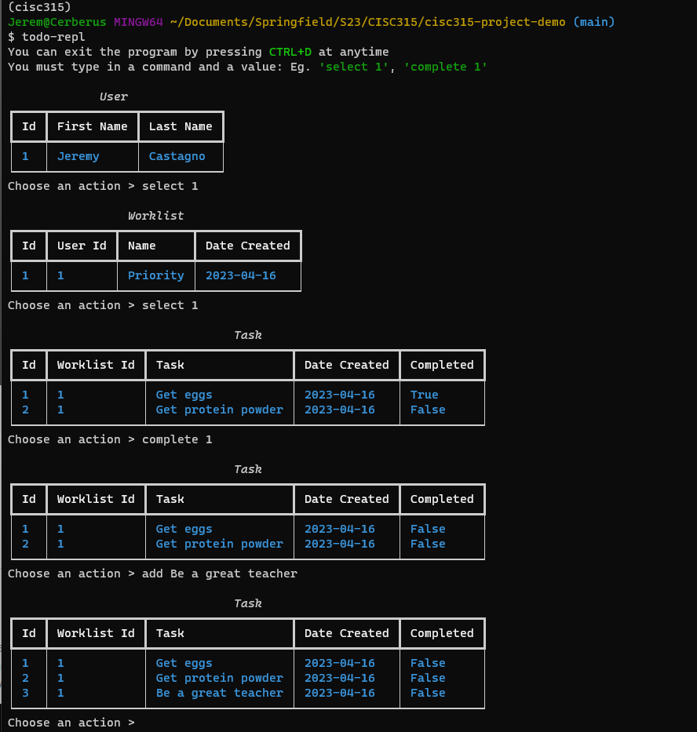
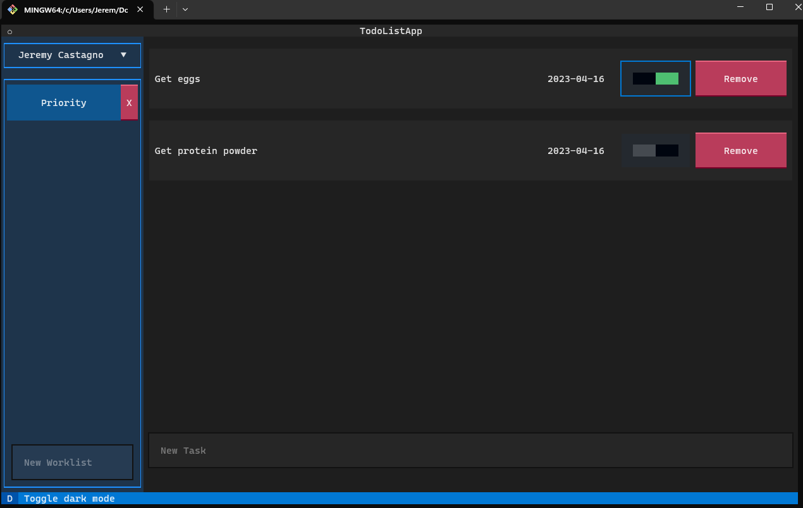

# Todolist


Welcome to the `todolist` app! This app is for demonstration purposes to showcase cool technology while working with a database. Some of the key technologies we use:

- SQLite - An embedded database to store all our users, worklists, and tasks
- Python - A fantastic, simple language we use to communicate with our database
- [SQLModel](https://sqlmodel.tiangolo.com/) - A python library that allows you to communicate with your database. This is an Object Relational Mapping (ORM) library.
- [Textual](https://textual.textualize.io/) - An awesome Terminal User Interface (TUI) that allows us to draw interactive graphics on our terminal
- [Prompt-toolkit](https://github.com/prompt-toolkit/python-prompt-toolkit) - An awesome library that allows you one to create a custom Read-Evaluate-Print-Loop (REPL) 


## Installation

Just type in `pip install -e .`
## Running the Demo

There are three (3) applications we created to interact with our database. Open up your terminal/shell and type one of the following commands:

1. `todo-create-db` - This will create the database for us. This must be executed at least one time before any other command. The database will be stored in `src/todolist/database/database.db`
2. `todo-repl` - This will launch the **repl** app. You will issue commands by entering them into the repl.
3. `todo-tui` - This will launch the **tui** app. You issue commands by clicking the widgets in your terminal.


`todo-repl` and `todo-tui` have the same capabilities when it comes to adding worklists and tasks. They are just different frontends to talk to the database. 

**Clear Tables and Data**

Anytime you want to clear the database and start fresh, just type `todo-create-db` into your shell.

## Database Design

There are three tables created in this app: `User`, `Worklist`, and `Task`. A `User` *creates* a `Worklist`. A `User` has zero or many `Worklist`(s). A user can add a `Task` to a `Worklist` they own. The `Worklist` *has* zero or many `Task`(s). 

```mermaid
erDiagram
    User {
        int id PK
        string first_name
        string last_name
    }
    Worklist {
        int id PK
        int user_id FK
        string date_created
    }
    Task {
        int id PK
        int worklist_id FK
        string date_created
        bool completed
    }

    Worklist ||.. o{ Task : has
    User ||.. o{ Worklist : creates
```

## Walkthrough

All the main code lives inside the folder `src/todolist`:

```
todolist
├─ tui
│  ├─ widgets
│  │  └─ select.py
│  ├─ style.css
│  └─ app.py
├─ repl
│  ├─ helper.py
│  ├─ console.py
│  └─ app.py
├─ db.py
└─ database
   ├─ database.db
```

Let's talk about each section.

### `database`

The database folder holds the file `database.db`. This is a SQLite database file that stores all the data for our app. YOu can open this database with Beekeeper or even SQLite[ browser](https://sqlitebrowser.org/). 

### `db.py`

This is our python module that contains the definition of the tables in our database. We are using SQLModel to define the tables. For example

```python
class User(SQLModel, table=True):  # 
    id: Optional[int] = Field(default=None, primary_key=True)  # this will autoincrement by default
    first_name: str
    last_name: str 
```
defines a class called User that inherits from SQLModel. This will ensure that a table called `user` may be created. The data types of the fields are the type hints in Python.

We also creat helper functions that help us talk to the database:

```python
def get_users() -> List[User]:
    with Session(engine) as session:
        return list(session.query(User).all())
```

This functions creates a `Session` with our database where we can query all the rows in the User table. Usually you would do this with SQL like:

```sql
SELECT *
FROM user
```

However, the ORM allows us to do this all within Python (and the ORM handles writing SQL). This function will return a list of User objects (the rows in our table).


### repl

The repl is created using prompt-toolkit. The main application is under the file `app.py`. The files `console.py` and `helper.py` provide function and objects that the help `app.py`.

Here is the main loop of our app:

```python
def cli():
    state = AppState() # contains our app sate
    session = PromptSession() # allows us to prompt the user

    console.print("You can exit the program by pressing [success]CTRL+D[/success] at anytime")
    console.print("You must type in a command and a value: Eg. 'select 1', 'complete 1'")
    console.print()
    loop = True
    while loop:
        try:
            if state.app_step == Step.show_user:
                loop = execute_command(session, state, 'all_user_list', model=User)
            elif state.app_step == Step.show_worklist:
                loop = execute_command(session, state, 'all_worklist_list', model=Worklist)
            elif state.app_step == Step.show_task:
                loop = execute_command(session, state, 'all_tasklist_list', model=Task)
        except KeyboardInterrupt:
            continue
        except EOFError:
            break
        except EntityNotFound as e:
            console.print(f"{e}\n")
        except Exception:
            console.print_exception()
            
    console.print('GoodBye!')
```

The basic idea is we have a while loop that repeatedly asks for commands. We execute those commands (which are often reading or writing to the database) and loop again.

Here is a screenshot of the interface:



### tui

This folder contains all the code for the tui interface. The main app is inside the file `app.py`. All the *styles* of the app, which configure how the app *looks*, are in `style.css`. This is a much more advanced interface than the `repl` interface.

Here is a screenshot of the interface:




